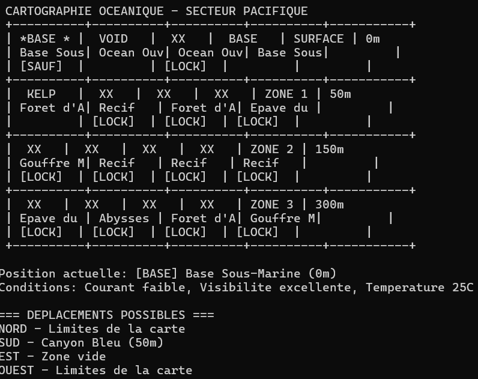
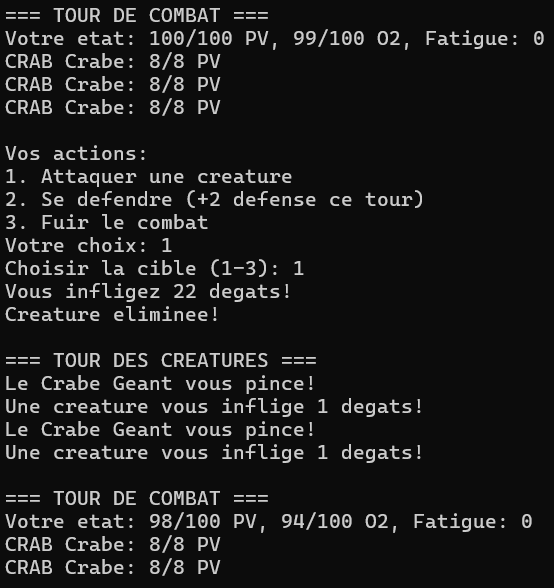
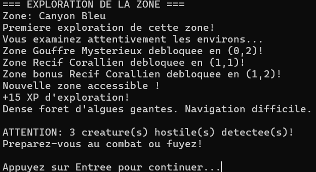
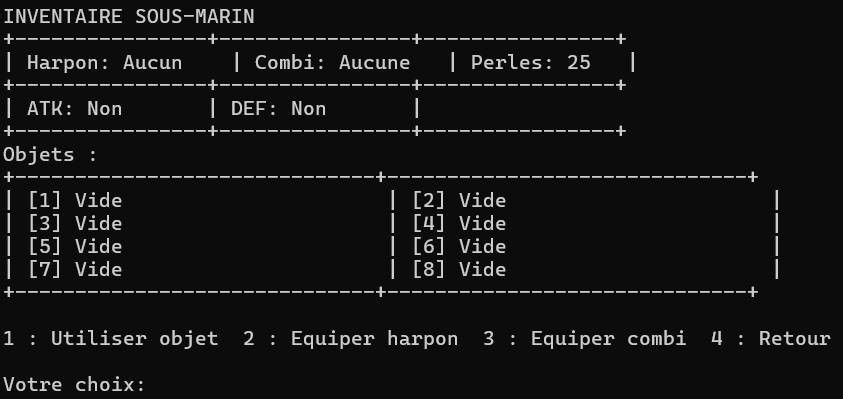
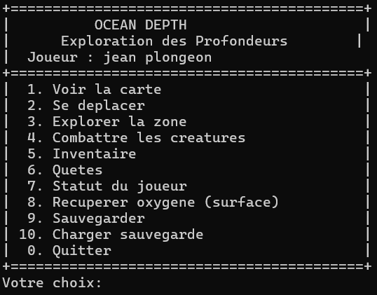
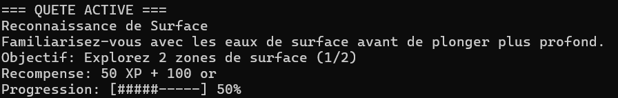
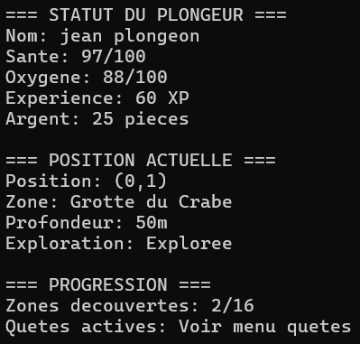

# Progression OceanDepths

## Étapes réalisées

- [x] Étape 1 : Génération créatures
  - Système de créatures marines avec types différents (Poisson, Crabe, Requin, Boss)
  - Liste chaînée pour gérer plusieurs créatures simultanément
  - Statistiques variables selon le type (PV, attaque, défense)
  - Placement des créatures sur la carte selon la profondeur

- [x] Étape 2 : Attaque joueur
  - Système d'attaque avec calcul de dégâts
  - Gestion des équipements (harpon influe sur l'attaque)
  - Coût en oxygène par attaque
  - Messages descriptifs selon l'arme utilisée

- [x] Étape 3 : Attaque créatures
  - Ordre d'attaque basé sur la vitesse des créatures
  - Effets spéciaux par type :
    - Requin : frénésie sanguinaire (<50% PV = +30% dégâts)
    - Crabe : carapace résistante (défense élevée)
    - Boss : attaque double (étreinte tentaculaire)
  - Perte d'oxygène due au stress du combat

- [x] Étape 4 : Récompenses
  - Système de loot après combat (30% de chance)
  - Récompenses variables : capsules O2, trousses de soin, stimulants, antidotes
  - Récompenses spéciales pour les boss (équipements légendaires)
  - Gain de perles et XP proportionnel à la difficulté

- [x] Système de carte océanique
  - Grille 4x4 avec zones de types variés (récifs, épaves, forêts d'algues, grottes, fosses)
  - Profondeurs croissantes (0m à 300m)
  - Système de déblocage progressif des zones
  - Exploration marquant les zones visitées

- [x] Gestion du joueur
  - Stats complètes : PV, O2, fatigue, XP, perles
  - Équipement avec bonus (harpon pour attaque, combinaison pour défense)
  - Consommation d'oxygène selon la profondeur
  - Game over et respawn à la base

- [x] Système d'inventaire
  - 8 emplacements pour objets
  - Types d'objets : consommables et équipements
  - Système d'équipement pour harpon et combinaison
  - Effets des consommables appliqués correctement (PV, O2, fatigue)
  - Interface de gestion avec menu interactif

- [x] Système de quêtes
  - 6 quêtes progressives (exploration surface → boss final)
  - Suivi automatique de la progression
  - Récompenses en XP et perles
  - Affichage avec barre de progression

- [x] Sauvegarde/Chargement
  - Sauvegarde complète (carte, joueur, inventaire, quêtes)
  - Chargement avec vérification de compatibilité
  - Menu au démarrage pour nouvelle partie ou chargement

- [x] Interface utilisateur
  - Menu principal avec toutes les options
  - Affichage de la carte avec symboles ASCII
  - Statut détaillé du joueur
  - Messages clairs et informatifs
  - Système de navigation intuitif

## Captures d'écran

### Carte océanique

### Système de combat

### Exploration de zones

### Gestion d'inventaire

### Menu principal

### Système de quêtes

### Statut du joueur

## Difficultés rencontrées

### 1. Dépendances circulaires entre headers
**Problème** : Les fichiers `joueur.h` et `inventaire.h` s'incluaient mutuellement, causant des erreurs de compilation.

**Solution** : Utilisation de déclarations anticipées (forward declarations) avec `typedef struct Plongeur Plongeur;`.

### 2. Application des effets des objets consommables
**Problème** : Utiliser un objet diminuait sa quantité mais n'appliquait pas les effets (restauration PV/O2, réduction fatigue).

**Solution** : Modification de `utiliser_objet()` pour accepter un pointeur `Plongeur*` et application des effets au joueur selon les attributs de l'objet.

### 3. Affichage d'objets vides dans l'inventaire
**Problème** : Les objets avec quantité = 0 s'affichaient avec des informations fausses.

**Solution** : Ajout de vérification `quantite > 0` dans les conditions d'affichage et nettoyage complet des attributs lors de la suppression.

### 4. Compilation et configuration du projet
**Problème** : CLion ne détectait pas automatiquement le CMakeLists.txt et les options de build étaient grisées.

**Solution** : Création manuelle du fichier CMakeLists.txt puis rechargement du projet.
